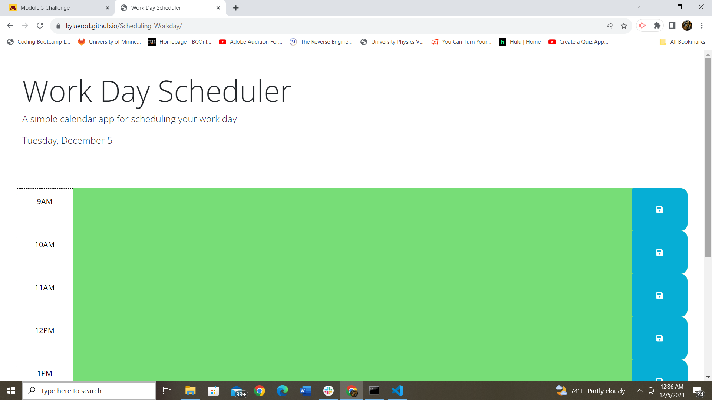
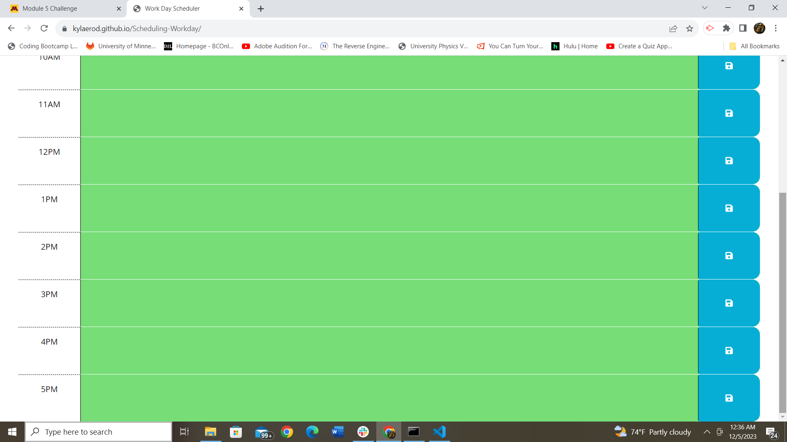

# Work Day Scheduler

## Description

This project is to allow the user to store their workday calendar locally. They should be able to refresh the page and still have their day stored on the calendar. The times should also correspond with the current time, gray being in the past, red being current, and green meaning future. This showcases the power of javascript ith local storage and the use of day.js and its amazing uses.

## Installation

This project was completed using starter code from gitHub by username crispy-octo-meme. It was then improved by adding javascript. The only adjustment to code was an addition of times and the adjustment of spacing.

## Usage

By starting with a basic skeleton, you then add in javascript for the function of the calendar. 

## Credits

Code that was referenced by gitHub unsername crispy-octo-meme, whos gitHub is linked below along with the starter code I used for this project.

https://github.com/coding-boot-camp/crispy-octo-meme

I was also provided this resource as well as instruction from the University of Minnesota's Coding bootcamp administration.

https://bootcampspot.instructure.com/courses/4983/assignments/64683?module_item_id=1115839

These links were also used to brush up on basics:

https://www.delftstack.com/howto/jquery/get-the-current-date-and-time-using-jquery/#google_vignette

https://stackoverflow.com/questions/6787383/how-to-add-remove-a-class-in-javascript

https://mirzaleka.medium.com/the-complete-guide-to-day-js-fb835a5d945a

## License

MIT License

Copyright (c) 2023 Kyla

Permission is hereby granted, free of charge, to any person obtaining a copy
of this software and associated documentation files (the "Software"), to deal
in the Software without restriction, including without limitation the rights
to use, copy, modify, merge, publish, distribute, sublicense, and/or sell
copies of the Software, and to permit persons to whom the Software is
furnished to do so, subject to the following conditions:

The above copyright notice and this permission notice shall be included in all
copies or substantial portions of the Software.

THE SOFTWARE IS PROVIDED "AS IS", WITHOUT WARRANTY OF ANY KIND, EXPRESS OR
IMPLIED, INCLUDING BUT NOT LIMITED TO THE WARRANTIES OF MERCHANTABILITY,
FITNESS FOR A PARTICULAR PURPOSE AND NONINFRINGEMENT. IN NO EVENT SHALL THE
AUTHORS OR COPYRIGHT HOLDERS BE LIABLE FOR ANY CLAIM, DAMAGES OR OTHER
LIABILITY, WHETHER IN AN ACTION OF CONTRACT, TORT OR OTHERWISE, ARISING FROM,
OUT OF OR IN CONNECTION WITH THE SOFTWARE OR THE USE OR OTHER DEALINGS IN THE
SOFTWARE.
